# AutoKernel: To know more about Ai Compiler
## 一、The overview of Ai Compiler
In recent years, AI technology oriented with machine learning and deep learning has been rapidly developed, and deep neural network has been widely used in various industries:  
1. CV (computer vision): target detection, scene recognition, image segmentation, etc.  
2. Smart voice: voice recognition, voiceprint recognition, etc.  
3. NLP (Natural Language Processing): automatic search engine, dialogue service robot, text classification, intelligent translation, etc.  
4. Scientific research: applied in many research fields such as physics, biology, medicine, etc. High-energy particle collision classification, cosmic celestial map data analysis, galaxy shape modeling, protein folding prediction of biological structure, precision medical treatment and disease prediction.      
       
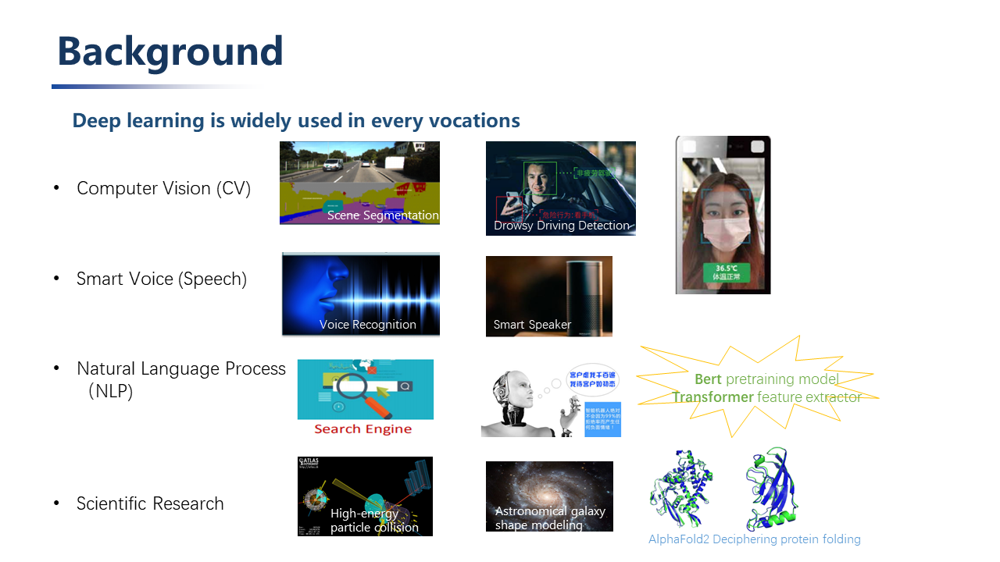  
      
These applications have spawned more new models: CNN, RNN, LSTM, GAN, GNN, and also spawned the emergence of deep learning frameworks such as Tensorflow, Pytorch, Mxnet, and Caffe. At present, the training framework has begun to converge, gradually forming a duo situation where PyTorch leads the academic world and TensorFlow leads the industry.    

However, in order for deep learning algorithms to be implemented, they must be deployed on hardware, such as Google’s TPU, Huawei’s Kirin NPU, and other architectural innovations on FPGA.    
     
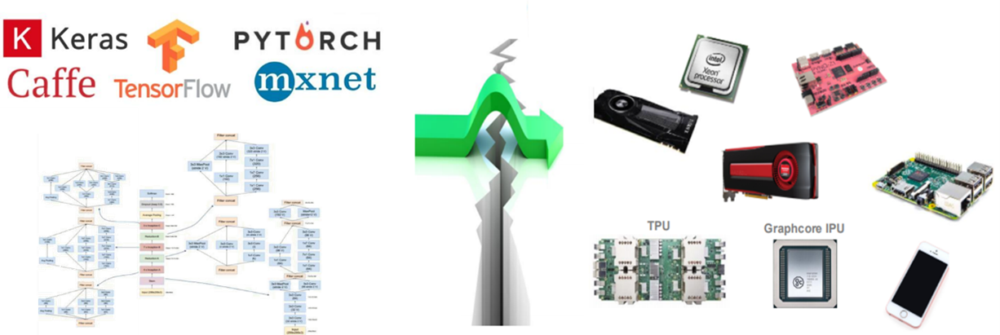  
       
When it comes to how to deploy the models trained by these training frameworks to different terminal hardware, this requires a deep learning neural network compiler to solve this problem.    

Before the emergence of neural network compilers, we used traditional compilers.    
**Traditional Compilers：**  
Take LLVM (low level virtual machine) as an example, its input is high-level programming language source code, and its output is machine code. It consists of a series of modular compiler components and tool chains.   
LLVM is divided into three parts: front-end, middle-end (optimized) and back-end through modules. Whenever a new programming language appears, only the corresponding front-end needs to be developed, and the programming language is converted into the intermediate representation of LLVM; similarly, when a new hardware architecture appears, only the corresponding back-end needs to be developed and connected to the intermediate representation of LLVM.  
The modularization avoids the problem of compiler adaptability caused by the refurbishment of the programming language and CPU architecture, and greatly simplifies the development of the compiler.   
    
   
     
**Neutral Network Compiler：**  
Its input is the model definition file trained by the deep learning training framework, and the output is the code that can be efficiently executed on different hardware. 
      
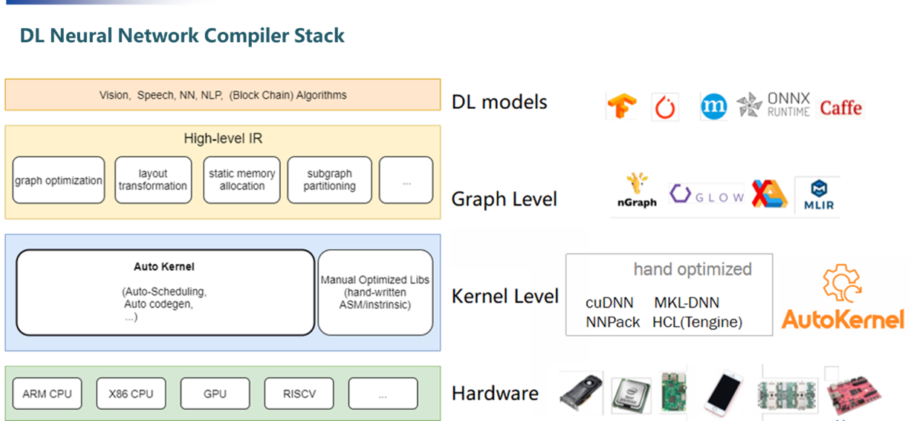  
     
It is composed of four levels from top to bottom：  
1. The top layer is connected to the algorithm models trained by various deep learning training frameworks (Tensorflow, Caffe, Pytorch, Mxnet, etc.).    
2. Layer level (High-level IR): The structure of the neural network can be expressed as a calculation graph, and layer-level operations are to perform some operations on the calculation graph that have nothing to do with the specific hardware and framework, such as operator fusion, memory allocation optimization, Derivation of data types and data dimensions, etc.     
      
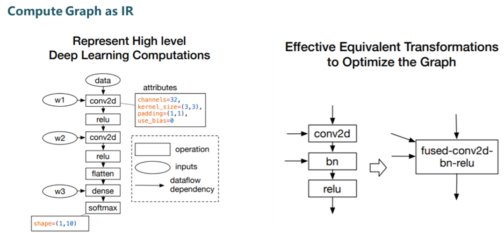  
> _We can use operator fusion to avoid frequent direct reading and writing of intermediate data between registers and memory, thereby improving overall inference performance  。_  
     
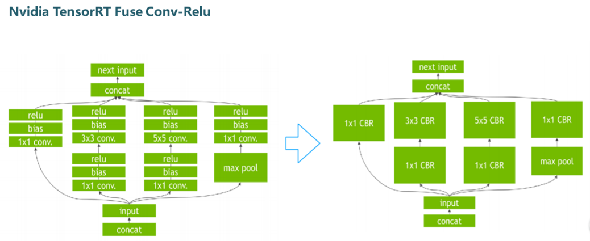  
> _Nividia通过把conv, bn, relu这三个算子融合成一个算子 fuse- CBR. 实现了三倍的推理性能提升。_  
     
3.  算子层级（operator level/kernel level）算子层级主要是张量计算。为了实现这些计算在硬件上高效实现，发挥芯片的性能，通常硬件芯片配有专门优化的算子计算库，如Intel的MKL, Nvidia的CuDNN, TensorRT。这个层级需要支持每个硬件后端的每个算子实现。  
4.  各硬件后端：GPU, ARM CPU, X86 CPU, NPU等。  
     
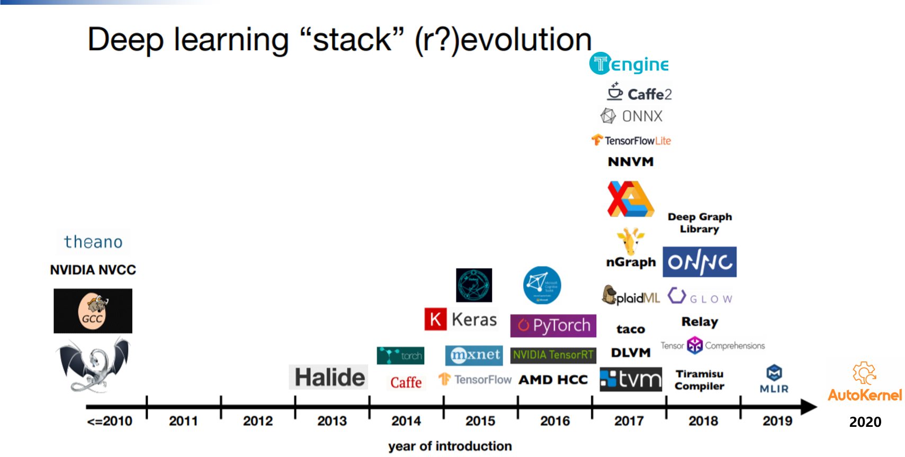  
>_自深度学习编译器的概念提出以来，各类编译器层出不穷。_  
      
___
## 二、TVM的前世今生  
在编译器快速发展的浪潮中，较为突出的便是TVM（Tensor Virtual Machine)。  

TVM最早提出是2017年，是深度学习系统的编译器堆栈。  

第一代TVM的设计借鉴了借鉴传统编译器框架LLVM的设计思路，设计抽象出中间表示层，不同的模型只需要开发相应的前端接口，不同的后端只需要开发相应的后端接口。  
TVM全称为Tensor Virtual Machine，属于算子层级，主要用于张量计算，提供独立于硬件的底层计算中间表示，采用各种方式（循环分块，缓存优化等）对相应的计算进行优化。第一代的图层级表示叫NNVM（Neural Network Virtual Machine）。NNVM的设计目标是：将来自不通深度学习框架的计算图转换为统一的计算图中间表示（IR)，对之进行优化。  

第一代的静态图存在一定的缺陷：  
1. 不能较好支持控制流，如分支跳转，循环等。  
2.  不能支持计算图输入形状，取决于输入tensor大小的模型，比如word2vec等。  

虽然Tensorflow有如tf.cond.Tf.while_loop的控制接口来在某种程度上解决第一个问题，tf.fold来解决第二个问题，但是这种方式对刚刚接触深度学习框架的小白来说不是特别友好。  

后面出现的动态图摒弃了传统的计算图先定义，后执行的方式，采用了计算图在运行时定义的模式，这种计算图就称为动态图。  
第二代TVM 的图计算层变为Relay VM，Relay和第一代的图计算表示NNVM的最主要区别是Relay IR除了支持dataflow（静态图）， 能够更好地解决control flow（动态图）。它不仅是一种计算图的中间表示，也支持自动微分。  
    
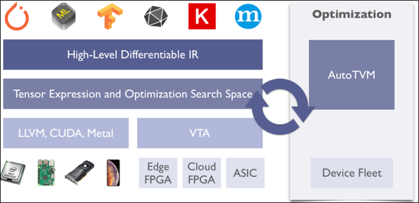  
      
总结一下，目前TVM的架构是：  
1. 最高层级支持主流的深度学习前端框架，包括TensorFlow,MXNet,Pytorch等。  
2.  Relay IR支持可微分，该层级进行图融合，数据重排等图优化操作。  
3.  基于tensor张量化计算图，并根据后端进行硬件原语级优化，autoTVM根据优化目标探索搜索空间，找到最优解。  
4.  后端支持ARM、CUDA/Metal/OpenCL、加速器VTA（Versatile Tensor Accelerator）。  
___  
## 三、Halide  
Halide于2012年提出，主要用于自动优化。其嵌入到C++中，是MIT研究人员专门为图像处理设计的一种程序语言。Halide语言易于编写，语法简单，数据结构清晰，能过自动对代码进行优化，使得程序获得比较好的执行效率。  
它设计的核心思想是把算法和调度分离。这样做的好处是，在给定算法的情况下只需要去调整它的Schedule 调度选择，不用重写算法实现不同的Schedule。当调整Schedule、探索设计空间时也不会担心因为重写算法而导致计算的正确性会发生变化。  
Algorithm部分主要是算法描述和计算的数学表达式。  
Halide于2012年提出，主要用于自动优化。其嵌入到C++中，是MIT研究人员专门为图像处理设计的一种程序语言。Halide语言易于编写，语法简单，数据结构清晰，能过自动对代码进行优化，使得程序获得比较好的执行效率。

它设计的核心思想是把算法和调度分离。这样做的好处是，在给定算法的情况下只需要去调整它的Schedule 调度选择，不用重写算法实现不同的Schedule。当调整Schedule、探索设计空间时也不会担心因为重写算法而导致计算的正确性会发生变化。

Algorithm部分主要是算法描述和计算的数学表达式。
Schedule部分则是告诉机器什么时候分配内存，如何计算（分块计算还是顺序计算）——目前已经提供了一些调度策略。  
    
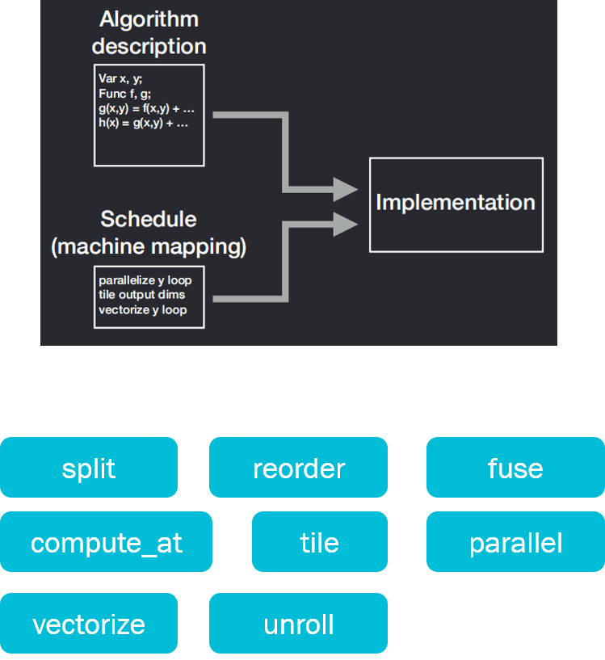   
     
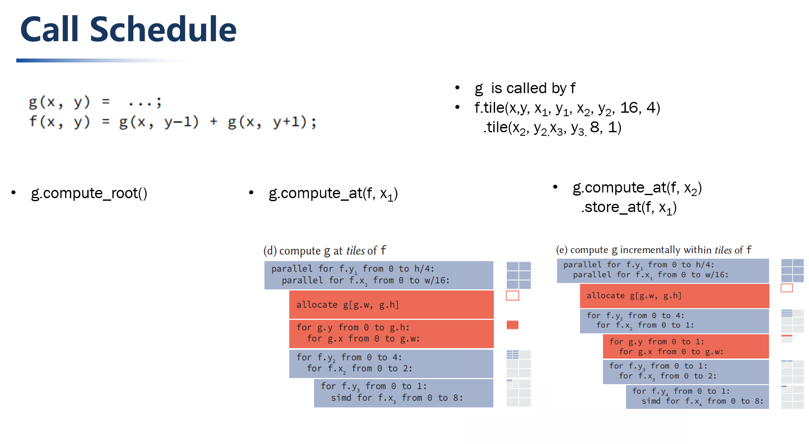  
> _不同调度策略考虑重复冗余计算和局部性（locality)的权衡。_    
    
___
## 四、AutoKernel  
深度学习模型能否成功在终端落地应用，满足产品需求，一个关键的指标就是神经网络模型的推理性能。  
目前的高性能算子计算库主要是由高性能计算优化工程师进行手工开发。然而新的算法/硬件的不断涌现，导致了算子层级的优化开发工作量巨大。同时优化代码的工作并不是一件简单的事，它要求工程师既要精通计算机体系架构，又要熟悉算子的计算流程。  
人才少，需求多，技术门槛高，因此我们认为算子优化自动化是未来的大趋势。而提出AutoKernel的初衷便是希望能把这个过程自动化，从小处入手，在算子层级的优化，实现优化代码的自动生成。  
      
  
     
AutoKernel的输入是算子的计算描述（如Conv、Poll、Fc），输出是经过优化的加速源码。  
这一工具的开发旨在降低优化工作的门槛，不需要有底层汇编的知识门槛，不用手写优化汇编。可通过直接调用开发的工具包便可生成汇编代码。同时还提供了包含CPU、GPU的docker环境，无需部署开发环境，只需使用docker便可。还可通过提供的插件——plugin，可以把自动生成的算子一键集成到推理框架中——Tengine。  
      
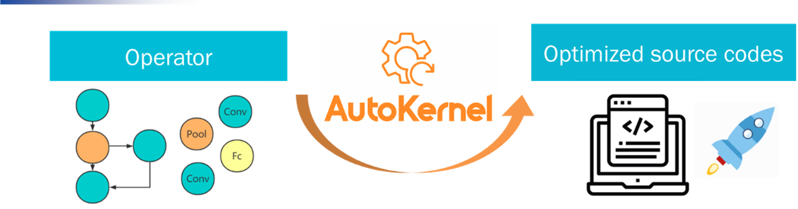  
     
对应地，算子层级的AutoKernel则主要分为三个模块，  
1. Op Generator：算子生成器，采用了开源的Hallide。  
2.  AutoSearch：目前还在开发中，目标是通过机器学习、强化学习常用算法自动搜索出优化策略。  
3.  AutoKernel Plugin：把生成的自动算子以插件的形式插入到Tengine中，和人工定制互为补充。  
     
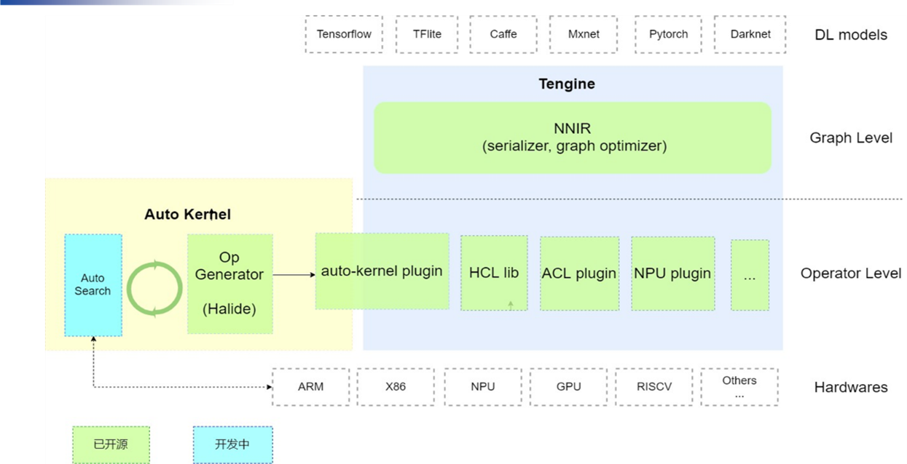    
> _Tengine对象层对接了不同的神经网络模型，图层级的NNIR包含了模型解析、图层优化，算子层级则包括高性能计算库（HCL lib）。_    
     
AutoKernel Plugin主要分为生成和部署两部分，生成部分用Hallid填写算法描述和调度策略，执行时指定后端类型（基本覆盖目前的主流后端）。  
部署部分则封装为Tengine的库，直接调用。  
     
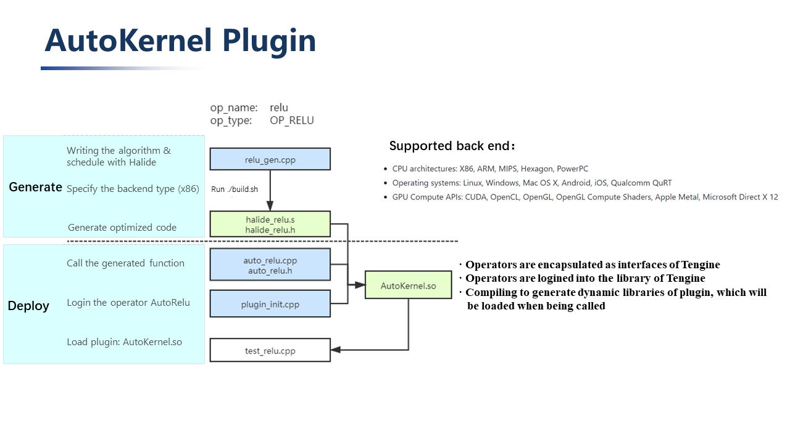    
      
相信随着更多开发者的加入，AutoKernel社区会有更大的突破与成长，在未来的深度学习编译器领域中，留下浓重的一笔！  
