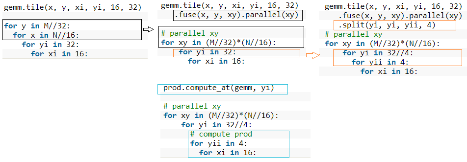

# GEMM: How to optimize schedule     

This section will demonstrate how to increase the performance of gemm by 200+ times on x86 CPU through scheduling strategy.   

## Optimize Goal：
1. Improve locality and improve cache hit rate   

2. Improve parallelism and make full use of SIMD for instruction vectorization and multi-core parallelism    

---------------
## Codes
- [data/06_gemm_optimization.cpp](data/06_gemm_optimization.cpp)
- [data/06_build.sh](data/06_build.sh)

The following code results are executed on a computer with Intel(R) Core(TM) i9-9900K CPU @ 3.60GHz, and the cache line size is 64 bytes.    

Execute`./build.sh [step]`, optional steps are 1 - 7.   

Firstly, execute the code before and after optimization to see the effect
```bash
root@bd3faab0f079:/AutoKernel/doc/tutorials/data# ./06_build.sh 1
step =  1
M N K = 640 640 640     err 0.00        [rep 50] autokernel | blas      240.8523 ms     1.1376 ms
root@bd3faab0f079:/AutoKernel/doc/tutorials/data# ./06_build.sh 7
step =  7
M N K = 640 640 640     err 0.00        [rep 50] autokernel | blas      1.2131 ms       1.1390 ms
```
It can be seen that the performance after optimization has increased by 200+ times than before optimization, and the performance of autokernel is close to that of the optimized computing library OpenBLAS.    

There is a compilation and execution script build.sh under the source code path. The execution script must specify the optimization step step. The optional step is from 1 to 7, where step=1 is not optimized by default, and step=7 is the most optimized. Each optimization step will be described in detail below.   
## STEP 1


The GEMM calculation is described as follows:    
```cpp
    Var x,y;
    RDom k(0, K);
    Func gemm("gemm");

    //1: default
    gemm(x, y) += A(k, y) * B(x, k);
```

Step1 defaults without schedule scheduling strategy optimization.

Execution result
```bash
root@bd3faab0f079:/AutoKernel/doc/tutorials/data# ./06_build.sh 1
step =  1
M N K = 640 640 640     err 0.00        [rep 50] autokernel | blas      240.8523 ms     1.1376 ms
```
## STEP2
In this step, we use tiled tiles. The purpose of chunking is to make full use of the cache. If the original loop is large, the tiles are changed to small blocks of data to calculate, so that the data calculated each time can stay in the cache more comfortably, without experiencing repeated evictions (repetitive addition and deletion of data in the cache) . The reorder operation is performed after the block is divided, and the order of the two nested loops is exchanged. The purpose is to make the innermost memory accessible. We divide the x and y dimensions into 16x8 small blocks to calculate:   

```cpp
    //step2 : tile
    gemm.update()
        .tile(x, y, xo, yo, xi, yi, 16, 8)
        .reorder(xi, yi, k, xo, yo);
```
Execute result
```bash
root@bd3faab0f079:/AutoKernel/doc/tutorials/data# ./06_build.sh 2
step =  2
M N K = 640 640 640     err 0.00        [rep 50] halide | blas  81.8148 ms      1.1281 ms
```
Performance has been optimized from `240ms` to `82ms`, an increase of nearly 3 times    

## STEP3
We add vectorize based on the previous step. Vectorization is to convert several scalar calculations (scale) into a vector calculation (vector), making full use of SIMD vector instructions. Most modern CPUs support SIMD (Single Instruction Multiple Data). In the same CPU cycle, SIMD can execute the same operation/instruction on multiple values at the same time.    
```cpp
     gemm.update()
            .tile(x, y, xo, yo, xi, yi, 16, 8)
            .reorder(xi, yi, k, xo, yo)
            .vectorize(xi, 8);
```
Execution resullt
```bash
root@bd3faab0f079:/AutoKernel/doc/tutorials/data# ./06_build.sh 3
step =  3
M N K = 640 640 640     err 0.00        [rep 50] autokernel | blas      27.5433 ms      1.1445 ms
```
The performance was optimized from 82ms to 27ms, which was accelerated by nearly 3 times. It can be seen that around the two optimization purposes mentioned earlier: optimizing memory access and improving parallelism, from step 1 to step 3, the performance has been improved by nearly 9 times.   
## STEP4
The scheduling strategy adds parallelization on the basis of step3. Parallelizing a loop is to divide each iteration of the loop into multiple threads or processors for simultaneous processing. Each thread processes through the loop body, but processes different data.    
```cpp
    gemm(x, y) += A(k, y) * B(x, k);
    gemm.update()
        .tile(x, y, xo, yo, xi, yi, 16, 8)
        .reorder(xi, yi, k, xo, yo)
        .vectorize(xi, 8)
        .parallel(yo);
```
Execution result
```bash
root@bd3faab0f079:/home/chunying/AutoKernel/doc/tutorials# ./06_build.sh 4
step =  4
M N K = 640 640 640     err 0.00        [rep 50] autokernel | blas      7.2605 ms       1.1605 ms
```
After adding parallelization, build.sh specifies four threads by default, and the performance is directly increased by nearly 4 times, from 27ms to 7.3ms.    


## STEP5
The scheduling strategy adds unroll expansion on the basis of the previous step. If the statements in the loop body do not have data-related dependencies, loop unrolling can increase the chance of concurrent execution, make full use of registers, and reduce the number of memory loads and saves for each operation during the loop.   
```cpp
    gemm.update()
        .tile(x, y, xo, yo, xi, yi, 16, 8)
        .reorder(xi, yi, k, xo, yo)
        .vectorize(xi, 8)
        .parallel(yo)
        .unroll(xi)
        .unroll(yi,2);
```
Execution result
```bash
root@bd3faab0f079:/AutoKernel/doc/tutorials/data# ./06_build.sh 5
step =  5
M N K = 640 640 640     err 0.00        [rep 50] autokernel | blas      4.7617 ms       1.1597 ms
```
After unrolling, the performance is optimized from `7.3ms` to `4.8ms`.   
## STEP6
The previous block is divided into 16 x 8 small kernels. This step is first divided into 16 x 32 blocks, and then each block is divided into 16 x 8 sub-blocks. We merge the two outermost loops into one layer and parallelize this layer. The calculation description in this step adds a prod function to define the calculation of the sub-blocks. The calculation formula of the prod function is the same as the total gemm. We use compute_at to specify the calculation of prod under the yi dimension, and the calculation of prod is 16x8. Kernel, the general logic is as follows:   


Full codes are listed below:   
```cpp
    Func prod;
    prod(x, y) += A(k, y) * B(x, k);
    gemm(x, y) = prod(x, y);

    gemm.tile(x, y, xi, yi, 16, 32)
        .fuse(x, y, xy).parallel(xy)
        .split(yi, yi, yii, 4)
        .vectorize(xi, 8)
        .unroll(xi)
        .unroll(yii);

    prod.compute_at(gemm, yi)
        .vectorize(x, 8).unroll(y);

    prod.update()
        .reorder(x, y, k)
        .vectorize(x, 8)
        .unroll(x)
        .unroll(y)
        .unroll(k, 2);
```
Execution result
```bash
root@bd3faab0f079:/AutoKernel/doc/tutorials/data# ./06_build.sh 6
step =  6
M N K = 640 640 640     err 0.00        [rep 50] autokernel | blas      3.1824 ms       1.1373 ms
```
The performance of this step has been optimized by nearly 80 times from STEP1, and the performance is getting closer and closer to OpenBlas.    
## STEP 7
The operation added in this step is to rearrange the data of matrix B to make the memory read smoother when calculating the small kernel 16x8. Because the x dimension of the small kernel is divided by 16, the x dimension of the rearranged data B is also rearranged by 16.    

Full codes are listed below:   
```cpp
    Func B_interleave("B"), Bs("Bs");
    Bs(x, y, xo) = B(xo * 16 + x, y);
    B_interleave(x, y) = Bs(x % 16, y, x / 16);

    Func prod;
    prod(x, y) += A(k, y) * B_interleave(x, k);
    gemm(x, y) = prod(x, y);

    gemm.tile(x, y, xi, yi, 16, 32)
        .fuse(x, y, xy).parallel(xy)
        .split(yi, yi, yii, 4)
        .vectorize(xi, 8)
        .unroll(xi)
        .unroll(yii);

    prod.compute_at(gemm, yi)
        .vectorize(x, 8).unroll(y);

    prod.update()
        .reorder(x, y, k)
        .vectorize(x, 8)
        .unroll(x)
        .unroll(y)
        .unroll(k, 2);
    Bs.compute_root()
        .split(y, yo, yi, 16)
        .reorder(x, yi, xo, yo)
        .unroll(x)
        .vectorize(yi).parallel(yo, 4);
```
Execution result   
```bash
root@bd3faab0f079:/AutoKernel/doc/tutorials/data# ./06_build.sh 7
step =  7
M N K = 640 640 640     err 0.00        [rep 50] autokernel | blas      1.1957 ms       1.1425 ms
```
The performance is almost the same as OpenBlAS, and the distance from STEP1 has been accelerated by 200+ times.       
